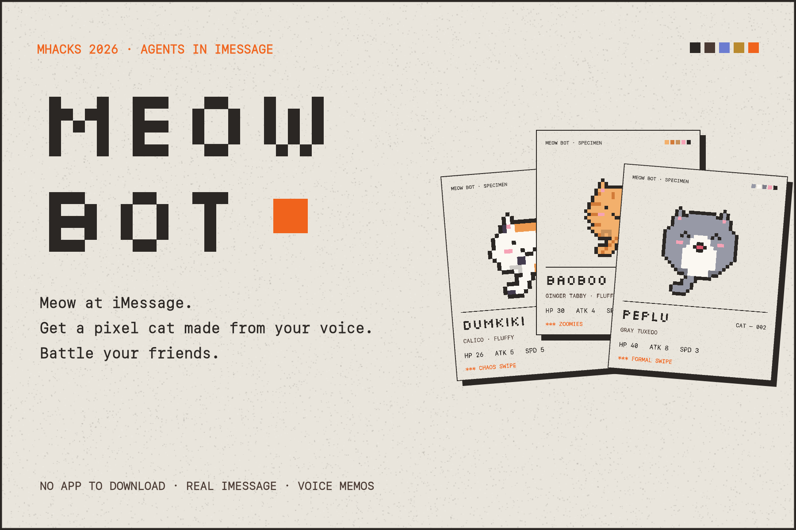
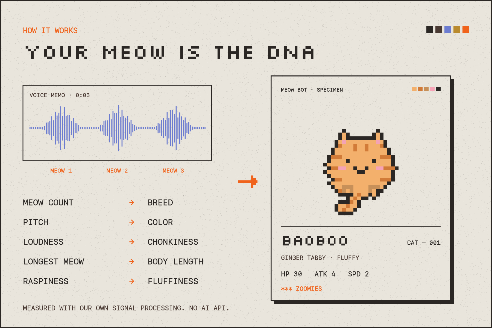
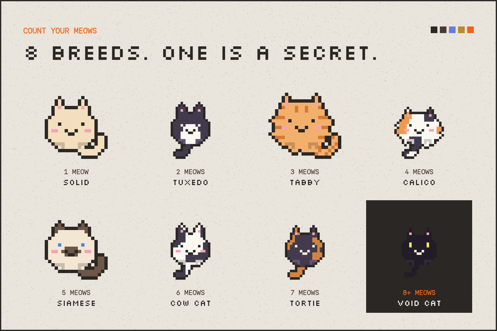
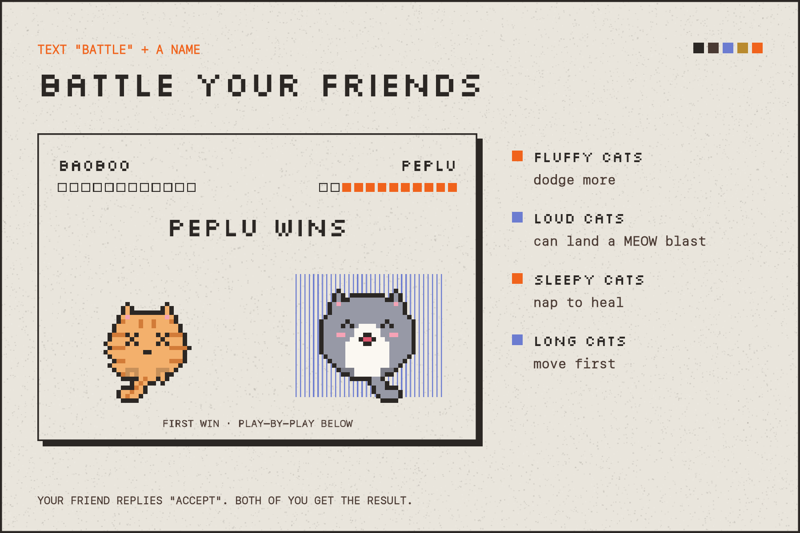

# Meow Bot

Meow at iMessage and it makes you a pixel cat from your voice. Collect cats, gift them to friends and battle them. No app to download.

Built at MHacks 2026 on [Photon Spectrum](https://photon.codes).

## What you can text it
- **A voice memo of you meowing, or typed meows** (`meow MEEOOOW mrrrow?`): you get a new cat, plus the reasons it looks that way.
- **`help`**: the menu card with every command.
- **`call me <your name>`**: sets the name friends use to find you. You need one before gifting or battling.
- **`my cats`**: your collection.
- **`send #2 to <friend>`**: gives a friend that cat.
- **`battle <friend>`** (or **`battle <friend> with #2`**): your friend replies `accept` (or `accept with #3`, or `nope`) and the cats fight.
- **`poster #2`** (or just `poster`): a wide poster of that cat to save or share.
- **`stop`**: the bot stops messaging you until you meow at it again.

`<friend>` is the name your friend picked with `call me`.

## How a meow becomes a cat

- **Number of meows sets the breed:** 1 solid, 2 tuxedo, 3 tabby, 4 calico, 5 siamese, 6 cow, 7 tortie. 8 or more gives a secret void cat.
- **Pitch** sets the color.
- **Loudness** sets how chonky it is.
- **Longest meow** sets the length.
- **A raspy meow** makes it fluffy.

Voice memos are decoded with ffmpeg, split into separate meows by loudness, and measured with our own pitch detection (autocorrelation). No AI or audio API. The recording is deleted right after the cat is made.

## Battles
Turn-based, up to 14 moves. Long cats move first, fluffy cats dodge more, loud cats can land a MEOW blast and sleepy cats nap to heal. Battles are seeded, so the same two cats with the same records always fight the same way.

## Run it (no coding needed)

1. **Install Bun.** You only do this once. Open Terminal and paste:
   `curl -fsSL https://bun.sh/install | bash`
   Then close and reopen Terminal.
2. **Install the bot.** In Terminal, type `cd ` (with a space), drag this folder onto the window, and press Enter. Then run:
   `bun install`
3. **Try it in the terminal first** by running `bun start`.
   Type things like `meow MEEOOOW`, `my cats` or `call me celink`. Press Ctrl+C to stop.
4. **Turn on iMessage.** Make a copy of `.env.example` named `.env` and paste your Photon project ID and secret into it. You get those from app.photon.codes. Run `bun start` again. On Photon's free and Pro plans, add each player's phone number under **Users** on the Photon dashboard; the **Texts on** column shows the number they should text.

Other scripts:
- `bun run test` plays a full two-player game with no keys and saves the images in `data/test/`.
- `bun run preview` draws every card for a set of sample cats into `data/preview/`.
- `bun run gallery` redraws the images in `docs/gallery/`.

**Optional: Fetch.ai (ASI:One)**

Put your `AGENTVERSE_API_KEY` in `.env`. Keep the bot running, and in a second Terminal window run:
`cd fetch-agent && pip3 install -r requirements.txt && python3 agent.py`
It prints the agent's address. Find the agent on agentverse.ai and chat with it from ASI:One. iMessage players and ASI:One players share the same cats, so they can battle each other.

## Files
- `src/engine.js`: meow analysis, cat drawing (pixel by pixel), names and battles
- `src/cards.js`: the images the bot sends (cat card, poster, collection, battle, menu)
- `src/brain.js`: what the bot says
- `src/bot.js`: Photon iMessage, plus a local bridge for the Fetch.ai agent
- `src/store.js`: a small JSON file that holds players and cats
- `src/selftest.js`, `src/preview.js`, `src/gallery.js`: test run, card previews, Devpost images
- `fetch-agent/agent.py`: the Fetch.ai agent (chat protocol, works in ASI:One)

The pixel font is Silkscreen (SIL Open Font License, see `assets/OFL.txt`).
